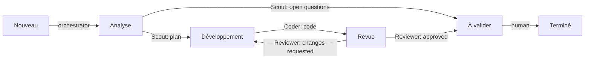
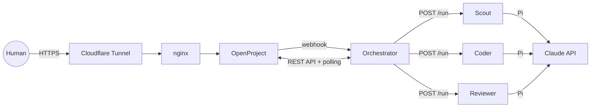

# AI Agents Demo on OpenProject

Demo of an ai agent farm built with Pi.dev.

Three agents (Scout, Coder, Reviewer) driven from OpenProject and run by Pi on the Claude API.

## How it works

A human creates a task in OpenProject. The task then moves through the workflow statuses, and each status
belongs to one agent. The agents answer in comments, as real OpenProject users, and hand the task to the next step.
The human steps back in at the end, or at any time by mentioning an agent in a comment.



| Agent | Status | Role |
| --- | --- | --- |
| **Scout** | Analyse | Restates the need, lists assumptions, writes a plan. Asks the human when information is missing. |
| **Coder** | Développement | Implements the plan, or addresses the Reviewer's remarks. |
| **Reviewer** | Revue | Reviews the code and sends it back to the Coder or to the human. |

### Architecture



- **OpenProject** is the only user interface: tasks, statuses, comments, mentions.
- **The orchestrator** (FastAPI) holds all the logic. An OpenProject webhook tells it which task changed, and polling
  every 30 s catches anything the webhook missed. Either way, it re-reads the task through the API, compares it with
  the last known state (SQLite) and derives deduplicated events: task created, status changed, new comment.
- **Routing**: a status change runs the agent that owns the new status. A human comment that mentions an agent
  (`@Coder`) runs that agent in *reply* mode, which never changes the status. Comments written by agents are ignored,
  so agents cannot trigger each other in a loop.
- **The agents** are stateless HTTP services around the Pi CLI, running with no tools, no session and no network
  access to OpenProject. They receive a bounded context (description, summary of earlier steps, last comments,
  latest full output of the counterpart agent) and must return JSON: `comment`, `next_status`, `summary`.
- **Publishing**: the orchestrator posts the comment with the agent's own OpenProject account, then applies the
  status only if the transition is allowed for that agent. Invalid output is retried once, then the task is set to
  *Bloqué* with an explanation.
- **Guardrails**: at most 10 agent runs per task, 3 review cycles (after that the task goes to the human),
  3 concurrent runs, 300 s timeout per run.
- **Credit tracking**: every run is priced from `orchestrator/pricing.json` and logged on a dedicated tracking task.
  At 50 % of `DEMO_BUDGET_USD` an alert is posted. At 80 % the automatic chaining stops and only mentions run agents.
  At 100 % no agent runs anymore. With an admin key, a daily comparison with Anthropic's Cost API is also posted.

```
agent/           agent service: HTTP server (Python stdlib) wrapping the Pi CLI
prompts/         system prompts for the 3 agents
orchestrator/    webhook, polling, routing, context, publishing, credit tracking
nginx/           reverse proxy behind Cloudflare Tunnel (self-signed TLS in dev)
```

## Model

All three agents use Anthropic's Claude Haiku 4.5, chosen for simplicity: one provider, one model, one pricing entry.
Pi (pi.dev) is not tied to a provider. Each agent can run a different model, including other cloud providers or local
models (e.g. through Ollama or any OpenAI-compatible server): declare the provider and model in `agent/pi/models.json`,
then set the agent's `MODEL` and `PROVIDER` (default `anthropic`) in `docker-compose.yml`. Local models cost nothing
per token, so give them zero prices in `orchestrator/pricing.json`.

> [!WARNING]
> The three agents run on `claude-haiku-4-5-20251001`, **supported until October 15, 2026**.
> After that date, agent runs will fail. To switch models, update all three together:
> `agent/pi/models.json` (model declared to Pi), `orchestrator/pricing.json` (price per million tokens,
> then set `verified` to `true`), and `MODEL_SCOUT` / `MODEL_CODER` / `MODEL_REVIEWER` in `.env`.

## Installation

1. **Server**: any Linux VPS with Docker and docker compose, key-based SSH, and a firewall with no inbound port
   except SSH restricted to your IP.
2. **Cloudflare Tunnel**: in Zero Trust > Networks > Tunnels, create a tunnel, copy its token to
   `CLOUDFLARE_TUNNEL_TOKEN`, and add your public hostname -> `HTTP` -> `nginx:80`.
   Cloudflare terminates TLS; `cloudflared` only opens outbound connections. Restrict who can reach the
   site with Cloudflare Access. nginx rejects any other host name.
3. **Configuration**: `cp .env.example .env`, then fill in at least `OPENPROJECT_HOST` (your public hostname),
   `OPENPROJECT_SECRET_KEY_BASE` (`openssl rand -hex 64`) and `WEBHOOK_SECRET` (`openssl rand -hex 32`).
   Remove the `COMPOSE_FILE` line, which enables the [development mode](#development-mode).
   The other keys come in steps 5 and 6.
4. **First start, OpenProject only**:
   ```bash
   docker compose up -d openproject nginx cloudflared
   ```
   The first start takes a few minutes (database setup). Then log in with `admin` / `admin` and set a new password.
5. **OpenProject setup** (as admin):
   1. **API**: in Administration > API and webhooks, make sure the REST API and API tokens are enabled.
   2. **Statuses**: in Administration > Work packages > Status, create the missing statuses among `Nouveau`,
      `Analyse`, `Développement`, `Revue`, `À valider`, `Terminé` and `Bloqué`. The orchestrator looks them up by
      name (case and accents are ignored).
   3. **Users**: create 4 users, `Scout`, `Coder`, `Reviewer` and `Orchestrator`. Their display names are what
      humans type after `@` to mention them.
   4. **Roles and workflow**: create an `Agent` role that can view work packages, add comments and edit work
      packages. In Administration > Work packages > Workflow, allow it only the agent transitions:
      Analyse -> Développement / À valider, Développement -> Revue, Revue -> Développement / À valider.
      The orchestrator needs a role allowed to move any task to `Analyse` and `Bloqué`, and humans need the
      remaining transitions (e.g. À valider -> Terminé).
   5. **Project**: create the project whose identifier is `OPENPROJECT_PROJECT` (`demo-agents` by default). Add the
      3 agents with the `Agent` role, the orchestrator and the humans as members.
   6. **API keys**: log in as each of the 4 users, go to My account > Access tokens, generate an API token and copy
      it to `OP_KEY_SCOUT`, `OP_KEY_CODER`, `OP_KEY_REVIEWER` and `OP_KEY_ORCHESTRATOR`.
   7. **Tracking task**: in the project, create a task (e.g. "Agent credit tracking") and put its ID in
      `OPENPROJECT_TRACKING_TASK_ID`. The orchestrator logs the cost of every run and the budget alerts there.
      No agent ever runs on it.
   8. **Webhook**: in Administration > API and webhooks > Webhooks, add a webhook with payload URL
      `http://172.28.10.10:8000/webhook` (the orchestrator's fixed IP on the internal Docker network, allowed by
      `OPENPROJECT_SSRF__PROTECTION__IP__ALLOWLIST`), the `WEBHOOK_SECRET` value as its secret, the work package
      and comment events, and only the demo project.
6. **Claude Platform**:
   1. Create one workspace per agent, each with its own API key (`ANTHROPIC_KEY_SCOUT`, `ANTHROPIC_KEY_CODER`,
      `ANTHROPIC_KEY_REVIEWER`) and a spend limit. That limit protects you even if the orchestrator's budget
      tracking fails.
   2. Set `DEMO_BUDGET_USD`, the budget tracked by the orchestrator.
   3. Optional, organization accounts only: create an admin key (`ANTHROPIC_ADMIN_KEY`) and list the 3 workspace IDs,
      comma-separated, in `ANTHROPIC_WORKSPACE_IDS`. This enables the daily comparison with the Cost API.
   4. Check the prices in `orchestrator/pricing.json`, then set `verified` to `true`.
7. **Full start and check**:
   ```bash
   docker compose up -d --build
   docker compose exec orchestrator python -m app.preflight
   ```
   The preflight checks the OpenProject accounts, the project, the statuses, the tracking task, the agents,
   the prices and the admin key. It prints ✅ or ❌ for each item.
   To test end to end, create a task with status `Nouveau` in the project. It moves to `Analyse`
   and the Scout replies within a minute.

### Alternative: Tailscale Funnel

Instead of Cloudflare Tunnel, you can expose nginx through [Tailscale Funnel](https://tailscale.com/kb/1223/funnel).
The `docker-compose.tailscale.yml` overlay publishes nginx on the host loopback only and does not start
`cloudflared`. Enable it with `COMPOSE_FILE=docker-compose.yml:docker-compose.tailscale.yml` in `.env`, and provide
your own nginx configuration in `nginx/tailscale/conf.d/`, which is not included in this repository.

## Development mode

The development mode runs the whole stack locally, or on a server reached by IP, without Cloudflare: nginx serves
HTTPS on port 443 with a self-signed certificate, and `cloudflared` is not started.

1. Enable the dev overlay in `.env` (already there if you copied `.env.example`):
   ```bash
   COMPOSE_FILE=docker-compose.yml:docker-compose.dev.yml
   ```
   On Windows, docker compose separates files with `;` by default. Either use `;` or add `COMPOSE_PATH_SEPARATOR=:`.
2. Set `OPENPROJECT_HOST` to the host name you will type in the browser (`localhost`, or the server's IP).
   OpenProject rejects requests for any other host.
3. Generate the self-signed certificate (the `nginx/dev/certs/` folder is git-ignored):
   ```bash
   mkdir -p nginx/dev/certs
   openssl req -x509 -newkey rsa:2048 -nodes -days 365 -subj "/CN=localhost" \
     -keyout nginx/dev/certs/dev.key -out nginx/dev/certs/dev.pem
   ```
4. Follow installation steps 4 to 7 above (step 4 can omit `cloudflared`), then open `https://localhost` and accept
   the certificate warning. The webhook goes through the internal Docker network, so it works the same way in dev.

**Tracing (optional)**: set `OTEL_SDK_DISABLED=false` in `.env` and start Jaeger with
`docker compose --profile apm up -d`. The UI listens on `127.0.0.1:16686`. On a remote server, reach it with
`ssh -L 16686:localhost:16686 <server>`. Each run appears as a trace, from the event received to the agent call and
the publication in OpenProject.

## Operations

| Task | Command |
| --- | --- |
| Check the configuration | `docker compose exec orchestrator python -m app.preflight` |
| Orchestrator logs (routing decisions) | `docker compose logs -f orchestrator` |
| Agent logs | `docker compose logs -f coder` |
| Run log | `docker compose exec orchestrator sh -c 'tail -n 5 /app/logs/runs-*.jsonl'` |
| Reset state (counters, costs) | `docker compose stop orchestrator && docker volume rm agents-openproject_orch_data` |

The volume name is prefixed with `agents-openproject`, the compose project name set in `docker-compose.yml`.
